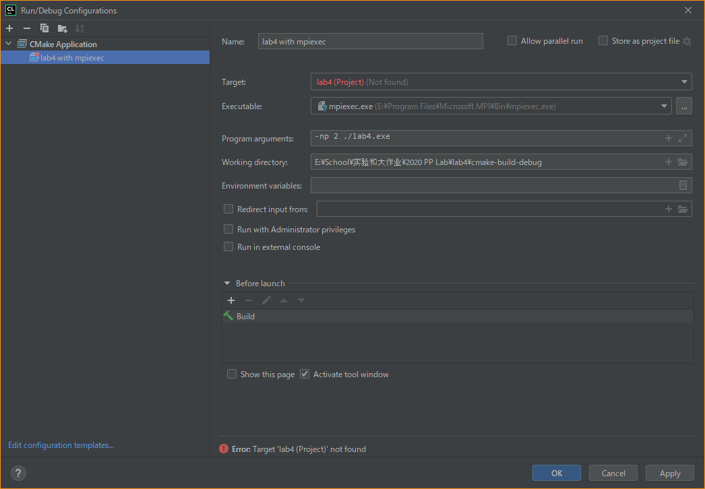

# ParallelProgrammingLab

+ 2020 SCUT Parallel Programming Experiment and Final Project (with bad-smell and unoptimized code)
+ 2022 SCUT Parallel and Distributed Computing Experiment

### Contents (2020)

+ lab1 - OpenMP
    + matrix-vector multiplication
    + trapezoidal integration
    + odd-even sort
+ lab2 - MPI
    + matrix-vector multiplication
    + trapezoidal integration
    + odd-even sort
+ lab3 - OpenMP + MPI
    + matrix-vector multiplication
+ lab4 - OpenMP + MPI
    + trapezoidal integration
+ groupby - Sequential, OpenMP, MPI, OpenMP + MPI
    + group by

### Contents (2022)

+ pdc_lab1 - Hadoop
    + web crawler
    + inverted index building using hadoop and map reduce
+ pdc_lab2 - MPI
    + PSRS sort

### Build and run

1. Compile manually

```bash
# build
cd lab2
mkdir build
cd build
cmake .. -G "MinGW Makefiles"
make -j8

# run
lab2.exe # single process
mpiexec -n 8 lab2.exe # multiple processes
```

2. Use CLion


